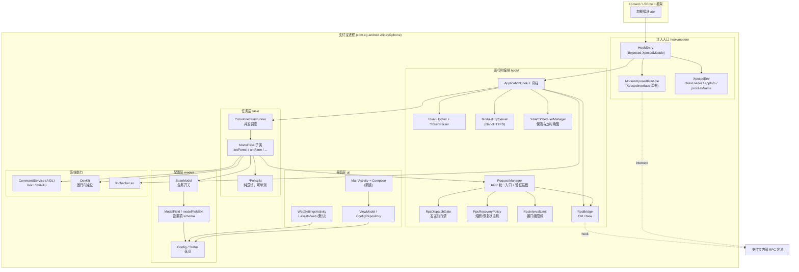
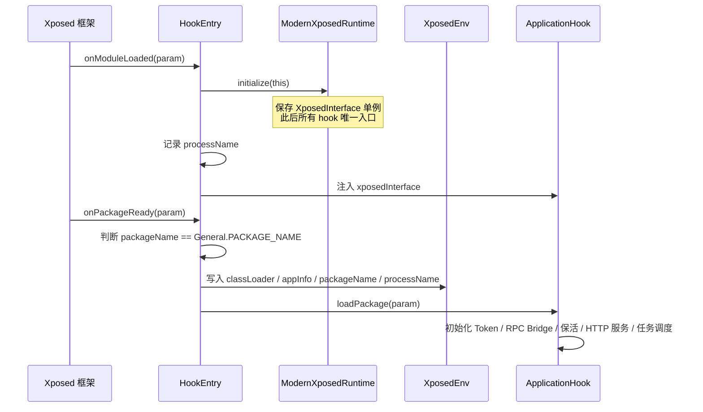
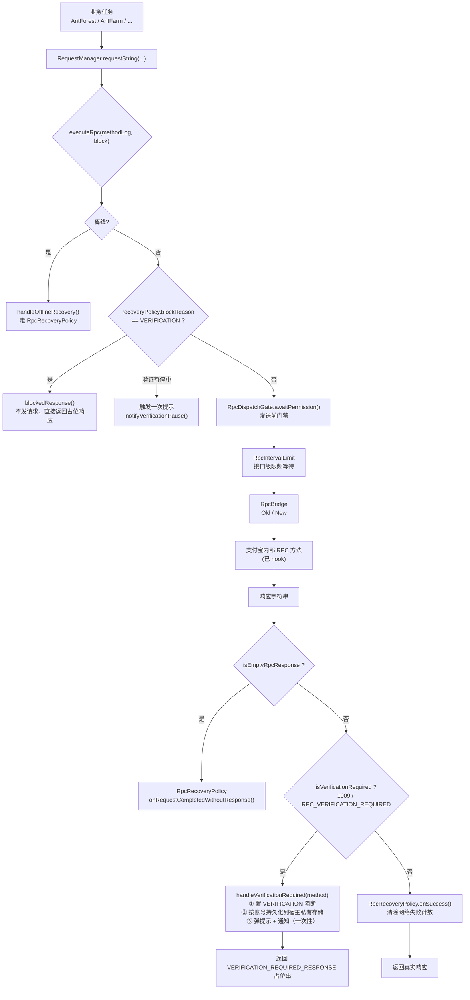
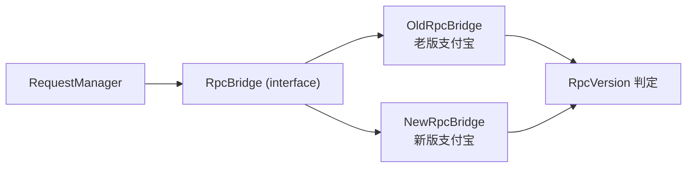
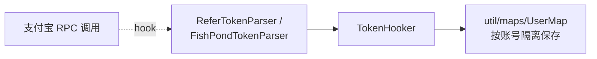
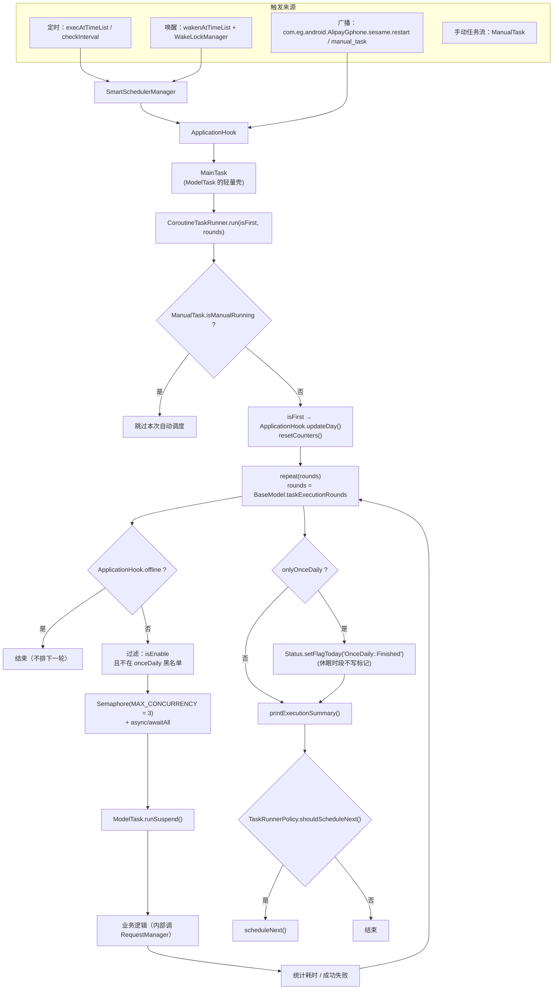
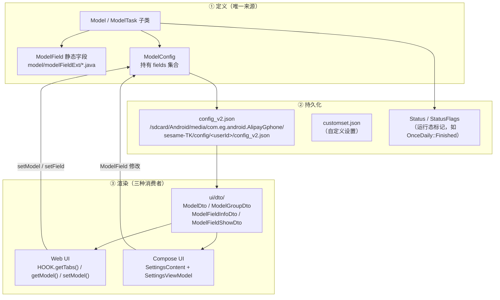
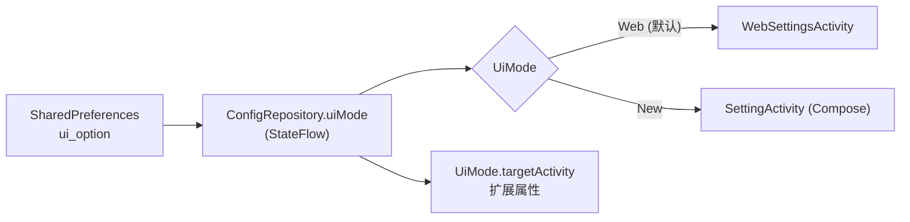
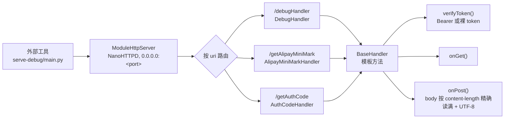

# 架构与数据流

> 配套：[`project-overview.md`](project-overview.md)（定位与结构）、[`component-api.md`](component-api.md)（组件与 API）、[`../AGENTS.md`](../AGENTS.md)（硬规则）

---

## 1. 全局视图



**一句话理解**：`ApplicationHook` 是唯一的编排者。业务任务不直接碰网络，而是通过 `RequestManager` 走统一 RPC 通道；任务的可开关与参数全部由 `ModelField` 描述，两套 UI 只是这份 schema 的不同渲染器。

---

## 2. 注入链路



### 关键文件

| 文件 | 职责 |
| --- | --- |
| `app/src/main/resources/META-INF/xposed/java_init.list` | 声明入口类（**唯一一行**：`fansirsqi.xposed.sesame.hook.modern.HookEntry`） |
| `META-INF/xposed/module.prop` | `minApiVersion=101`、`targetApiVersion=102`、`staticScope=true` |
| `META-INF/xposed/scope.list` + `res/values/arrays.xml` | 作用域：只有 `com.eg.android.AlipayGphone` |
| `hook/modern/HookEntry.kt` | libxposed `XposedModule` 实现，两个回调：`onModuleLoaded` / `onPackageReady` |
| `hook/modern/ModernXposedRuntime.kt` | `XposedInterface` 单例持有者；对外只暴露 `hook` / `replaceWithConstant` / `deoptimize` / `log` |
| `hook/modern/HookInvocation.kt` | 一次 hook 调用的上下文（`executable` / `thisObject` / `initialArgs` / `result` / `proceedCall`） |
| `hook/XposedEnv.kt` | 跨进程静态持有 classLoader、appInfo、进程名 |
| `hook/modern/ReflectionHelper.kt` | 反射工具（找类、找方法、找字段） |

### 设计约束

- **hook 必须走 `ModernXposedRuntime`。** 它统一设置了 `ExceptionMode.PROTECTIVE`（hook 抛错不影响宿主）并把调用封装成 `HookInvocation`。绕过它直接调 libxposed 会丢掉这两层保护。
- **只支持 libxposed 102 现代入口。** 旧版 API 82/100 的兼容层与 `xposed_init` 已被移除（见 `CHANGELOG.md` 2026-07-28 条目）。仓库内有 `Libxposed102MigrationTest` 守着这条约定 —— 它会断言 `src/main/assets/xposed_init` 不存在、`module.prop` 的版本号正确。
- `ApplicationHook` 只处理 `General.PACKAGE_NAME` 的包，其他进程直接 `return`。

---

## 3. RPC 数据流 ⭐ 最核心

所有业务请求最终都汇聚到 `hook/RequestManager.kt`。这是理解本项目**最关键**的一条链路。



### 3.1 为什么要有 `RequestManager` 这一层

它是**唯一的 RPC 出口**。正因如此，才能在单点做四件事：

| 能力 | 实现 |
| --- | --- |
| 统一拦截安全验证 | `isVerificationRequired()` 识别 `1009` / `RPC_VERIFICATION_REQUIRED` |
| 熔断与恢复 | `RpcRecoveryPolicy` 状态机（网络失败重试 / 离线 / 验证阻断三种原因，返回 `RecoveryDecision`） |
| 发送前门禁 | `RpcDispatchGate.awaitPermission()` —— 在**真正发送之前**再检查一次阻断状态 |
| 接口级限频 | `RpcIntervalLimit` + `DefaultIntervalLimit` / `FixedOrRangeIntervalLimit` |

### 3.2 验证暂停（Verification Pause）的完整语义

这是本项目最容易改错的逻辑，**改之前必读**：

| 维度 | 规则 |
| --- | --- |
| 触发 | 响应里出现 `1009` 或 `RPC_VERIFICATION_REQUIRED` |
| 作用域 | **按账号**，持久化在支付宝的宿主私有存储（`VERIFICATION_PREFS = "sesame_rpc_verification"`），进程重启后仍然生效 |
| 行为 | 阻断后续请求（返回占位响应 `VERIFICATION_REQUIRED_RESPONSE`），**不自动重启恢复** |
| 提示 | 单次阻断只提示一次，另有汇总计数；日志要区分「服务端原始验证」与「本地拦截」 |
| 恢复 | 只能人工：`showVerificationResumeDialog(activity)` / `resumeAfterManualVerification(intent)`，校验账户 + 一次性令牌，串行执行 |
| 重新进入 | 「恢复」会先等待旧业务 Job 退出，再重新开始 |
| 已知局限 | 已发出的请求无法撤回；限流等待与反射调用之间存在极短竞争窗口 —— **不得宣称「绝对零在途请求」** |

> 相关回归测试：`RequestManagerTest`、`RpcRecoveryPolicyTest`、`RpcDispatchGateTest`、`SlideCaptchaRemovalTest`。
> 设计依据：`docs/superpowers/specs/2026-08-01-energy-rain-verification-retry-design.md`（「验证只结束当前调用，不写当天暂停标记」）。

### 3.3 新旧 RPC 桥



- `hook/rpc/bridge/RpcBridge.java` 是接口，`requestString` / `requestObject` 有一整套默认重载（默认 `tryCount=3`，`retryInterval` 视重载而定）
- `RpcVersion` + `VersionHook` 根据支付宝版本决定用哪个桥
- `newRpc` 是用户可见开关（`BaseModel.newRpc`，说明文字是「使用新接口(最低支持 v10.3.96.8100)」）
- `hook/rpc/debug/DebugRpc.java` 用于 RPC 调试页（`RpcDebugActivity`）

### 3.4 Token 抓取



- `ReferTokenParser` 处理通用 `positionRequest` 位于 `requestData[0]` 的场景（`CHANGELOG` 2026-07-28 记录过该修复）
- `FishPondTokenParser` 处理福气鱼池的钓鱼风控令牌
- 每个账号独立保存，重启后仍可用

---

## 4. 任务调度数据流



### 4.1 关键参数与约束

| 项 | 值 / 来源 |
| --- | --- |
| 最大并发 | `MAX_CONCURRENCY = 3`（**硬编码**在 `CoroutineTaskRunner`，防请求过频触发风控；注释里标注了「可以做成配置项」） |
| 执行轮数 | `BaseModel.taskExecutionRounds`（默认 **1**，范围 1–99；源码注释：*「1轮就好，没必要2轮」*） |
| 每轮执行间隔 | `BaseModel.checkInterval`（默认 50 分钟） |
| 模块休眠时段 | `BaseModel.modelSleepTime`（默认 `0200-0201`）；休眠时**不写** `OnceDaily::Finished` |
| 超时 | `BaseModel.timeoutRestart` 开关；主流程超时已从原值调整为 **10 分钟** |
| 异常阈值 | `BaseModel.setMaxErrorCount`（默认 8） |
| 异常等待 | `BaseModel.waitWhenException`（默认 60 分钟） |
| 取消语义 | 配置重载 / 超时会**取消并等待实际业务 Job 退出**，避免旧任务与新一轮重叠 |

### 4.2 三类任务的边界（易错点）

用户手动任务、自动主流程、长期蹲点子任务三者共享调度槽，边界已明确划分：

- 手动任务流运行中 → **跳过整轮自动调度**（`ManualTask.isManualRunning`）
- 森林 / 庄园 / 运动主流程 → **占满调度槽直到结束**（否则会出现「启动即释放槽位」导致实际并发超限）
- 独立长期子任务（如蹲点）→ **不纳入主 Job 等待**，避免阻塞整轮结束
- 已运行任务 → 第二轮**不重复启动**

> 回归测试：`TaskRunnerPolicyTest`。并发核对结论见 `docs/superpowers/plans/2026-09-05-verification-and-log-errors.md`。

### 4.3 策略层（为什么到处是 `*Policy`）

任务类里混着 RPC 编排、状态判断和网络副作用，几乎不可测。项目采用的拆分是：

```
ModelTask 子类   ← 只管「什么时候调哪个 RPC、怎么解析响应」
   ↓ 调用
*Policy 对象     ← 纯函数/纯状态机，无副作用，可单测
```

现有策略类举例：`TaskRunnerPolicy`、`RpcRecoveryPolicy`、`FishPondPolicy`、`AntForestResponsePolicy`、`AntForestShieldRetryPolicy`、`EnergyWaitingPolicy`、`EnergyPvpChallengePolicy`、`ChouChouLeSchedulePolicy`(待补)、`MemberTaskProtocol`。

**新增带分支的业务逻辑时，判定部分必须落到策略层** —— 否则它永远不会被测试覆盖。

---

## 5. 配置数据流

本项目最有价值的架构特性：**设置项只定义一次，两套 UI 自动同步。**



### 5.1 设置项的类型体系

`model/modelFieldExt/` 下的每个类对应一种 UI 控件与一种序列化形式：

| ModelField 类型 | 语义 | Web DTO 的 `type` |
| --- | --- | --- |
| `BooleanModelField` | 开关 | `BOOLEAN` |
| `IntegerModelField` | 整数 | `INTEGER` |
| `StringModelField` | 字符串 | `STRING` |
| `ChoiceModelField` | 单选（配 `expandKey` 选项名数组） | `CHOICE` |
| `SelectModelField` | 多选（好友列表等） | `SELECT` |
| `SelectOneModelField` | 单选（列表型） | `SELECT_ONE` |
| `SelectAndCountModelField` | 选择 + 计数（如「浇水好友 + 次数」） | `SELECT_AND_COUNT` |
| `SelectAndCountOneModelField` | 同上，单选变体 | `SELECT_AND_COUNT_ONE` |
| `ListModelField` | 时间/范围列表（如 `0700,0730`） | `LIST` |
| `TextModelField` | 多行文本 | `TEXT` |
| `EmptyModelField` | 占位（纯展示） | `EMPTY` |

以「切换卡类型」为例，用户在 Web 里看到的就是这么一个对象：

```json
{ "code": "doubleCard", "configValue": "0", "name": "双击卡开关 | 消耗类型", "type": "CHOICE", "expandKey": ["关闭", "所有道具", "限时道具"] }
```

### 5.2 存储布局与迁移

```
/sdcard/Android/media/com.eg.android.AlipayGphone/sesame-TK/
├── config/
│   ├── config_v2.json                  # 默认/全局配置
│   └── <userId>/                       # 按账号隔离
│       ├── config_v2.json
│       ├── customset.json
│       └── friend.json                 # 好友列表快照
└── log/                                # 日志目录
```

- 路径定义在 `util/Files.kt`（`MAIN_DIR` / `CONFIG_DIR` / `LOG_DIR`）
- **自动迁移**：老格式 `config/config_v2-<userId>.json` 在首次读取时会被搬到 `config/<userId>/config_v2.json`，成功后删除旧文件
- 目录监听：`MainViewModel.startConfigDirectoryObserver()` + `util/DirectoryWatcher.kt` 让 UI 感知账号目录变化

### 5.3 UI 模式的选择

配置项 `ui_option`（存 `SharedPreferences`，key 前缀 `sesame-tk`）→ `ConfigRepository` → `UiMode`：



`UiMode.fromValue()` 对 `null` / 空串 / 未知值**一律回落到 `Web`** —— 这条由 `UiModeDefaultTest` 保护，不要改。

---

## 6. 内置 HTTP 服务

模块在宿主进程里跑了一个 NanoHTTPD 服务，用于与外部工具（如 `serve-debug/`）通信。



- 路由注册在 `ModuleHttpServer.init`，`register(path, handler, description)`
- 启动由 `ModuleHttpServerManager.startIfNeeded()` 负责，端口经 `util/PortUtil.java` 选取
- `BaseHandler` 是模板方法模式：**统一鉴权 + 统一异常兜底 + 统一 JSON 响应**（`ok` / `badRequest` / `unauthorized` / `methodNotAllowed` / `notFound`）。新增接口继承它即可
- Token 为空字符串时**默认放行**（如果不设 token 就等于不鉴权，注意别在生产里留空）
- 另一条反向链路：`BaseModel.sendHookData` + `sendHookDataUrl`（默认 `http://127.0.0.1:9527/hook`）把抓到的数据**主动转发**给 `serve-debug/main.py`

---

## 7. 系统能力边界

| 能力 | 实现 | 说明 |
| --- | --- | --- |
| root / Shizuku 命令 | `service/CommandService.kt` + `aidl/ICommandService.aidl` | 跑在独立 `:command` 进程，`exported=true`；`ShellManager` 封装执行 |
| Shizuku 连接 | `service/LsposedServiceManager.kt` + 手写 `ShizukuProvider` 声明 | Manifest 里注释了原因：解决 `provider is null` |
| 运行时定位 | DexKit（`org.luckypray.dexkit`） | 混淆后找不到类/方法时使用，产物落在 `AssetUtil.dexkitDestFile` |
| 原生校验 | `jniLibs/<abi>/libchecker.so` | **预编译**，无 C++ 源码（`src/main/cpp/` 被 gitignore）；`Detector.loadLibrary("checker")` 加载；加载失败会提示「缺少必要依赖」 |
| 保活 | `hook/keepalive/SmartSchedulerManager` + `util/WakeLockManager.kt` | 定时唤醒、`SCHEDULE_EXACT_ALARM` |
| 隐藏图标 | `IconManager` + Manifest 里的 `activity-alias` | 可隐藏图标；圣诞节自动切到 `MainActivityAliasChristmas` |

---

## 8. 扩展点：改这里通常要动哪几个文件

### 8.1 新增一个设置项（最常见）

```
① model/<你的 Model 类>.kt        加一个 ModelField 静态字段（含默认值、名称、类型）
② （可选）model/modelFieldExt/     只有需要新控件类型时才动
```

就这两步。落盘、两套 UI 渲染、Web DTO 都会自动跟上。若该设置影响任务行为，再回到任务类里读它。

### 8.2 新增一个业务任务

```
① task/<domain>/<Xxx>Task.kt      继承 ModelTask，声明 getFields()（配置项）、check()（是否可跑）、runSuspend()（逻辑）
② task/<domain>/<Xxx>Policy.kt    把分支判定抽出来，纯逻辑
③ task/<domain>/<Xxx>RpcCall.java 该业务的 RPC 方法名与参数封装
④ app/src/test/.../<Xxx>PolicyTest.kt  给策略层写测试
⑤ assets/web/images/icon/model/   放一张与 getIcon() 返回值同名的图标
⑥ CHANGELOG.md                    追加一行
```

RPC 必须经 `RequestManager`，不要自己起网络请求。

### 8.3 新增一个 hook

```
① 用 ReflectionHelper / DexKit 找到目标 Executable
② ModernXposedRuntime.hook(executable, before = { ... }, after = { ... })
③ 验证 XposedEnv.classLoader 已就绪（依赖注入时机，未就绪会 ClassNotFound）
```

### 8.4 新增一个 HTTP 接口

```
① hook/server/handlers/<Xxx>Handler.kt   继承 BaseHandler，实现 onGet / onPost
② ModuleHttpServer.init 里 register("/yourPath", XxxHandler(secretToken), "描述")
```

### 8.5 新增一个 Web 端纯逻辑 JS

```
① assets/web/js/<name>.js        写成 UMD（同时支持 module.exports 与 window 挂载）
② app/src/test/js/<name>.test.js 用 node:test 写合同测试
③ 页面里引用，并在测试里断言 HTML 确实引用了它（见 settings-search-contract 的做法）
```

`settings-search-contract.js` 是这个模式的范本：UMD 导出 + 纯函数 + 被 `node --test` 覆盖 + 测试还校验 `semi_index.html` 真的挂了这个脚本。

---

## 9. 日志与可观测性

| 关注点 | 位置 |
| --- | --- |
| 日志实现 | `util/Log.kt` + `util/Logback.kt`（SLF4J + Logback-Android） |
| 日志文件 | `/sdcard/Android/media/com.eg.android.AlipayGphone/sesame-TK/log/` |
| 记录开关 | `BaseModel.recordLog`（record 镜像总开关） |
| 查看器 | `ui/LogViewerActivity` + `ui/viewmodel/LogViewerViewModel.kt`（Compose，搜索/tag 过滤/仅看错误） |
| 抓包 | `BaseModel.debugMode`（说明：基于新接口）；转发地址 `sendHookDataUrl` |
| 状态栏通知 | `util/Notify.kt`、`BaseModel.enableOnGoing`（开启状态栏禁删） |
| 气泡提示 | `BaseModel.showToast` / `toastOffsetY` |
| 异常通知 | `BaseModel.errNotify` + `setMaxErrorCount` |

### 9.1 日志分类体系（三层）

日志唯一入口是 `Log` object，SLF4J 按 logger 名分文件落盘。写入分类文件时**统一镜像进 record.log**（受 `BaseModel.recordLog` 开关控制），保证「全部日志」聚合语义完整。

**第 1 层 · 业务日志（按功能模块域）**

| 分类 | API | 文件 | 收纳模块 |
| --- | --- | --- | --- |
| 森林 | `Log.forest()` | forest.log | antForest、antCooperate（合种）、reserve（保护地）、EcoProtection（古树）、antDodo（神奇物种） |
| 海洋 | `Log.ocean()` | ocean.log | antOcean（神奇海洋）、antFishPond（福气鱼池） |
| 庄园 | `Log.farm()` | farm.log | antFarm、AntFarmFamily、ChouChouLe（抽抽乐） |
| 果园 | `Log.orchard()` | orchard.log | antOrchard（芭芭农场果树） |
| 新村 | `Log.stall()` | stall.log | antStall（摆摊）、ReadingDada |
| 生活 | `Log.life()` | life.log | antMember、antSports、GreenFinance、Credit2101、AnswerAI、庄园捐步 |
| 其他 | `Log.other()` | other.log | 兜底（TokenHooker、无法归类的零散来源），目标是趋近于空 |

**第 2 层 · 系统日志**

| 分类 | API | 文件 | 定位 |
| --- | --- | --- | --- |
| 运行 | `Log.runtime()` / `Log.runtimeWarn()` | runtime.log | TaskRunner 调度/轮次/执行统计、ModelTask 任务开始结束、NewRpcBridge 状态摘要、SmartSchedulerManager、预唤醒。INFO/WARN 级别 |
| 错误 | `Log.error()` / `Log.printStackTrace()` | error.log | 异常统一出口：ErrorLogPolicy 签名去重 + 60 帧截断 |
| 抓包 | `Log.capture()` | capture.log | 仅 HookUtil 调用 |
| 调试 | `Log.debug()` / `Log.d()` | debug.log | logcat 可见，落盘需主动写 |

**第 3 层 · 聚合视图**：record.log（「全部日志」）= 所有业务/系统写入的镜像流。

新增业务模块一律走 `Log.biz(LogCategory.XXX, tag, msg)` 或对应分类便捷方法；域内子模块用 tag 维度区分（`[tag]: msg` 前缀），不再为小模块单独开文件。

### 9.2 容量策略

| 分类 | 单文件上限 | 总量上限 | 保留 |
| --- | --- | --- | --- |
| ocean / orchard / stall / life / runtime（业务小配额） | 3MB | 16MB | 7 天 |
| record / error / capture / forest / farm / other / debug（核心） | 7MB | 64MB | 7 天 |

`system` / `captcha` 文件名为 LOG_NAMES 预留占位，暂无写入方。

**日志使用约定**（来自 `2026-09-05` 计划）：日志需要区分「服务端原始验证」与「本地拦截」；单次阻断只提示一次并保留汇总计数 —— 避免刷屏，也避免误判。

---

## 10. 测试的架构含义

本项目的测试分两层，且**第二层会约束你的重构自由度**：

| 层 | 位置 | 手段 |
| --- | --- | --- |
| 策略单测 | `app/src/test/java/.../*PolicyTest.kt` | JUnit 4 + `org.json`，测纯逻辑 |
| **源码契约测试** | 同上目录下的一批文件 | **直接读主源码文本做断言** |

源码契约测试用 `File("src/main/java/...").readText()`，然后 `assertTrue/assertFalse(text.contains("..."))`。典型代表：

- `Libxposed102MigrationTest` —— 断言 `module.prop` 版本、`java_init.list` 内容、`xposed_init` 不存在
- `EnergyRainCoroutineTest` —— 断言源码里**没有** `ENERGY_RAIN_VERIFICATION_FLAG`
- `RequestManagerTest` / `SlideCaptchaRemovalTest` / `ForestChouChouLeTest` / `TaskRunnerPolicyTest` / `AntMemberTest` / `AntFarmFamilyTest`

**两个直接后果**：

1. 这类测试的工作目录是 `app/` 模块目录，必须经 Gradle（`:app:testDebugUnitTest`）运行；
2. **重命名标识符、删除字符串字面量会直接打挂测试** —— 重构前先搜一下有没有对应断言。

所以架构上它们是「防腐层」：把若干设计决策（只支持 102、验证不写持久标记、滑块服务已移除）固化成了可执行的约束。
