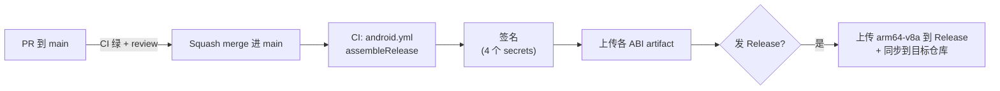

# 开发方式、命令与回归清单

> 硬规则与已知阻塞见 [`../AGENTS.md`](../AGENTS.md)。本文件是「怎么干活」的操作手册。

---

## 1. 环境准备

### 1.1 必备清单

| 组件 | 版本 | 备注 |
| --- | --- | --- |
| JDK | **17+** | 系统 PATH 里仍挂着 JDK 1.8 的 `bin`，但 `JAVA_HOME` 已指向 JDK 17，Gradle 以 `JAVA_HOME` 为准 |
| Android SDK | platform **37.0** + build-tools **37.0.0** | `compileSdk = 37`（`minorApiLevel = 0`）、`targetSdk = 36` |
| Android NDK | 29.0.14206865 | **仅当 `app/src/main/cpp/CMakeLists.txt` 存在时才需要**；该目录被 gitignore，正常克隆后没有 |
| Gradle | 9.5.0 | 用仓库自带 wrapper，**不要用系统 gradle** |
| git | 任意 | 必需。`versionCode` 靠 `git rev-list --count HEAD` 生成，且必须是完整克隆 |
| Node.js | 18+ | 只有跑 Web 端 JS 测试时才需要（无 npm 依赖） |
| Python | 3.12+ | 只有跑 `serve-debug/` 调试台时才需要，用 `uv` 管理 |

### 1.2 ⚠️ 项目路径必须纯 ASCII

AGP 会直接拒绝含非 ASCII 字符的项目路径，`Configure project :app` 阶段就中止：

```
org.gradle.api.tasks.StopExecutionException: Your project path contains non-ASCII characters.
This will most likely cause the build to fail on Windows. Please move your project to a different directory.
```

本仓库因此从 `...\WorkBuddy\蚂蚁森林辅助\Sesame-VN` 迁到了 **`C:\Users\Administrator\WorkBuddy\senmayi\Sesame-VN`**。

本地构建不含原生代码（`app/src/main/cpp` 不存在，`externalNativeBuild` 块不生效，`isCIBuild` 为 false），
理论上也能用 `android.overridePathCheck=true` 绕过。但那是把风险往后推，**推荐直接放在 ASCII 路径下**。

**当前开发机状态（2026-09-21 实测，已配通）**：

| 组件 | 位置 / 版本 |
| --- | --- |
| JDK 17 | `C:\env\Java\jdk-17_windows-x64`（17.0.7 LTS）；`JAVA_HOME` 已指向，且 `%JAVA_HOME%\bin` 在用户 PATH 最前 |
| Android SDK | `C:\env\android-sdk`；含 platform 37.0 / build-tools 37.0.0 / platform-tools；`ANDROID_HOME` 与 `ANDROID_SDK_ROOT` 已指向 |
| Gradle 9.5.0 | wrapper 发行包已预置进缓存，见 [`../AGENTS.md`](../AGENTS.md) 的说明 |
| 验证结果 | `:app:compileDebugKotlin` → `BUILD SUCCESSFUL in 4m 9s` |

> 环境变量改动只对**新起的进程**生效。改完要重开终端，否则当前会话看不到。

> 💡 在 Windows 上不装 Android Studio 也能配好 SDK 与 JDK，可参考本机已安装的 `android-sdk-setup` 技能。

### 1.3 配置 `local.properties`

```properties
sdk.dir=C\:\\env\\android-sdk
```

该文件已在 `.gitignore` 中，**不要提交**。本机已写好。

### 1.4 首发验证

```bash
./gradlew :app:compileDebugKotlin     # 最快能反映"环境是否通了"
./gradlew :app:assembleDebug          # 产出 APK 才算真正跑通
```

### 1.5 曾记录的坑：Gradle 回环连接失败（本次未复现）

历史上本机 JDK 的 Unix 域临时路径导致过 Gradle 回环连接错误，解法是在环境里加（**只改环境变量，不要动 `gradle.properties`**）：

```bash
export JAVA_TOOL_OPTIONS=-Djdk.net.unixdomain.tmpdir=C:/Windows/Temp
```

Windows cmd/PowerShell：

```powershell
$env:JAVA_TOOL_OPTIONS = "-Djdk.net.unixdomain.tmpdir=C:/Windows/Temp"
```

2026-09-21 在 JDK 17 + ASCII 路径下**未复现**（未设置该变量即构建成功），保留备查。

---

## 2. 常用命令

### 2.1 构建

```bash
./gradlew :app:assembleDebug           # 调试包（不混淆、不裁剪资源）
./gradlew :app:assembleRelease         # 发布包（minify + shrinkResources，CI 走这个）
./gradlew :app:compileDebugKotlin      # 只编译 Kotlin，最快的语法/类型验证
./gradlew clean                        # 清理（等价于 Delete buildDirectory）
```

Windows 下把 `./gradlew` 换成 `./gradlew.bat`。

产物路径与命名：

```
app/build/outputs/apk/{debug,release}/Sesame-VN-<abi>-<versionName>.apk
```

共 5 个 ABI：`arm64-v8a` / `armeabi-v7a` / `x86` / `x86_64` / `universal`。

### 2.2 测试

```bash
# Kotlin / Java 单元测试（全部）
./gradlew :app:testDebugUnitTest

# 单个测试类
./gradlew :app:testDebugUnitTest --tests "fansirsqi.xposed.sesame.task.antForest.EnergyRainCoroutineTest"

# 单个测试方法
./gradlew :app:testDebugUnitTest --tests "fansirsqi.xposed.sesame.task.antForest.EnergyRainCoroutineTest" --tests "*能量雨安全验证只结束当前流程且后续可重试*"

# 加 --no-daemon 在 CI 或环境不稳时更可靠
./gradlew.bat :app:testDebugUnitTest --tests "..." --no-daemon

# Web 端 JS 合同测试（Node 内置 node:test，无需 npm install）
node --test app/src/test/js/
node app/src/test/js/settings-search-contract.test.js    # 单文件
```

测试报告：`app/build/reports/tests/testDebugUnitTest/index.html`

### 2.3 静态检查

```bash
./gradlew :app:lintDebug
```

> 仓库里有 `lint-baseline.xml` 的 gitignore 条目，说明 lint 曾被使用；但**没有配置自定义 lint 规则或 `lintOptions`**，改 lint 行为要显式加配置。

### 2.4 Python 调试台

```bash
cd serve-debug
uv sync
uv run main.py            # FastAPI，接收模块转发的 Hook 数据（/hook）
uv run webui.py           # 本地跑 Web 设置页，改版式时热调试
```

`webui.py` 需要先把 `app/src/main/assets/web` 拷成 `serve-debug/web`，并准备 `config.json` 与 `friend.json`。详见 `serve-debug/README.MD`。

---

## 3. 测试体系

### 3.1 两层测试

| 层 | 位置 | 手段 | 数量级 |
| --- | --- | --- | --- |
| 策略单测 | `app/src/test/java/**/*PolicyTest.kt`、`*ProtocolTest.kt` | JUnit 4 + `org.json`，打纯逻辑 | 多数 |
| **源码契约测试** | 同目录，如 `Libxposed102MigrationTest`、`EnergyRainCoroutineTest` | **读主源码文本做断言** | 十余个 |
| Web JS 合同测试 | `app/src/test/js/settings-search-contract.test.js` | Node `node:test` | 1 个文件、多个用例 |

**当前基线**：`2026-09-05` 计划记录为 **109 项测试、0 失败、0 错误**。但注意 —— 该基线是在「临时移走 `ChouChouLeSchedulePolicyTest.kt`」之后取得的；**当前 `main` 上测试编译是坏的**（见 `../AGENTS.md` 的「已知阻塞」）。

### 3.2 ⚠️ 源码契约测试的两个陷阱

这类测试长这样：

```kotlin
val sourceText = File("src/main/java/fansirsqi/xposed/sesame/hook/RequestManager.kt").readText()
assertTrue(sourceText.contains("handleVerificationRequired"))
assertFalse(sourceText.contains("ENERGY_RAIN_VERIFICATION_FLAG"))
```

**陷阱一：工作目录是 `app/` 模块目录。**
相对路径 `src/main/...` 是相对 **`app/`**，不是仓库根。所以：

- ✅ 用 Gradle 跑（`:app:testDebugUnitTest`）—— Gradle 会把工作目录设为模块目录
- ❌ 不要从仓库根用裸 IDE runner 或 `java -cp` 直接跑

**陷阱二：重命名标识符 / 删字符串会打挂测试。**
这些测试把设计决策固化成了字符串断言。重构前先搜：

```bash
grep -rn "你要改的标识符" app/src/test/
```

已知被断言的字符串包括：`ENERGY_RAIN_VERIFICATION_FLAG`、`pauseForVerification`、`本次流程结束，后续可再次执行`、`module.prop` 的版本值、`java_init.list` 的入口类名、`xposed_init` 不存在、`settings-search-contract.js` 在 HTML 里的引用等。

### 3.3 写新测试的约定

- 业务分支逻辑 → 先在 `task/<domain>/` 加 `*Policy.kt`（**纯函数**），再给它写测试。不要把判定写死在任务类里
- 测试方法名用中文反引号（项目惯例）：

```kotlin
@Test
fun `能量雨安全验证只结束当前流程且后续可重试`() { ... }
```

- 需要构造响应时用 `org.json.JSONObject`（`testImplementation(libs.org.json)` 已就绪）
- 测试文件放在与主源码**相同的包路径**下

---

## 4. 日常开发流程

本项目已有的三份实施计划固定了一套工作流，建议沿用。

### Step 1 — 写设计稿（非平凡改动必做）

`docs/superpowers/specs/YYYY-MM-DD-<topic>-design.md`，结构固定：

```markdown
# <功能名>设计

## 背景          ← 现在的实现有什么问题
## 目标          ← 可验收的行为列表
## 实现设计      ← 改哪些文件、用什么策略
## 错误处理      ← 失败路径怎么办
## 测试          ← 列出要覆盖的用例
```

### Step 2 — 写实施计划

`docs/superpowers/plans/YYYY-MM-DD-<topic>.md`，开头四段 + 勾选式步骤：

```markdown
**Goal:** 一句话
**Architecture:** 用什么机制实现
**Tech Stack:** Kotlin / JUnit 4 / ...
## Global Constraints
- 文件 UTF-8 无 BOM；注释中文
- 不自动完成或绕过安全验证
---
### Task 1: <任务名>
**Files:**
- Modify: `app/src/main/java/.../Xxx.kt`
- Modify: `app/src/test/java/.../XxxTest.kt`
- [ ] **Step 1: 写入失败测试**
- [ ] **Step 2: 运行测试并确认失败**  → Run: `./gradlew.bat :app:testDebugUnitTest --tests "..."`
- [ ] **Step 3: 写入最小实现**
- [ ] **Step 4: 运行定向测试**
```

**每一步都要带明确的验证命令**，这是这套流程的核心价值。

### Step 3 — 红-绿循环

1. 先写会失败的测试（确认它失败得**符合预期**，而不是因为编译错误）
2. 写最小实现让它通过
3. 跑定向测试 → 跑全量测试 → `:app:compileDebugKotlin`

### Step 4 — 收尾

- [ ] 用户可见的改动 → 追加 `CHANGELOG.md` 表格一行（`| 日期 | 模块 | 功能改动 |`）
- [ ] 同步实施计划的勾选状态；若结论与原计划不同，在计划里加「实施记录」段落说明真实结果
- [ ] 新文件检查 UTF-8 无 BOM
- [ ] 若新增 `.txt` / `.json`，用 `git add -f`（`.gitignore` 有宽泛规则）

---

## 5. 分支模型与提交（GitHub Flow）

本项目采用 **GitHub Flow**：只有一条长期分支 `main`，它**必须始终处于可发布状态**；所有改动都经短生命周期的特性分支 + Pull Request 合入。

```mermaid
flowchart LR
    M["main<br/>(永远可发布)"] -->|"1. 切出"| F["feature/xxx · fix/xxx<br/>docs/xxx · chore/xxx"]
    F -->|"2. 推送 + 开 PR"| PR["Pull Request"]
    PR -->|"3. CI 绿 + Review"| OK{"可以合入?"}
    OK -- 是 -->|"4. Squash merge<br/>+ 删分支"| M
    OK -- 否 --> F
```

### 5.1 硬性约定

| 项 | 约定 |
| --- | --- |
| 长期分支 | **只有 `main`**。不存在也不需要 `develop` / `release` / `hotfix`，不要新建 |
| 直接推 `main` | **禁止**。`main` 只接受 PR 合入（建议在 GitHub 上开 branch protection 强制） |
| 特性分支命名 | `feature/<简述>`、`fix/<简述>`、`docs/<简述>`、`chore/<简述>`、`ci/<简述>`；全小写、连字符分隔，如 `fix/verification-pause-stuck` |
| 分支生命周期 | 短。合入后立即删除（GitHub 仓库设置里开 "Automatically delete head branches"） |
| 合入方式 | **Squash and merge**。一个 PR 压成一个提交，`main` 保持线性、可回溯 |
| 合入前提 | CI 绿 + 至少一次 review。**不要**用 `--admin`、`--force` 或本地直推绕过 |
| 提交信息 | **中文**，可带 emoji / 类型前缀（仓库现状：`✅test:`、`fix(森林):`、`feat(神奇海洋):`、`docs:`、`ci:`） |
| 历史改写 | **不强推 `main`**。需要撤回时新增回退提交（`2026-09-05` 计划有先例） |
| 提交范围 | 不要把 `local.properties`、`*.jks`、`serve-debug/webhook.db` 等加进来 |
| 发布 | 合入 `main` 后打 tag / 发 Release，`android.yml` 的 release 事件会签名并分发 APK（见 §8） |

### 5.2 一次改动的完整流程

```bash
git switch main && git pull                       # 1. 同步主干
git switch -c fix/verification-pause-stuck        # 2. 切特性分支（命名见 5.1）
# ...改代码，按职责分组提交...
git push -u origin fix/verification-pause-stuck   # 3. 推分支（首次带 -u）
# 4. 在 GitHub 上开 PR，等 CI 绿 + review
# 5. Squash and merge，删掉特性分支，本地 git switch main && git pull
```

> **分支沿革**：主干曾叫 `codex/dev`，2026-09-22 先改为 `develop`、随即定为 `main` 并切换为 GitHub Flow。
> 同期删除了监听 `yang` 分支的 `.github/workflows/debug.yml`（`yang` 在远端从不存在，该流水线是死配置）。
> `docs/superpowers/plans/2026-09-05-*.md` 里提到的 `codex/dev` 是历史记录，**不要改**。

### 5.3 本机推送要先过代理

本机直连 GitHub 不通，仓库已配置**只对 github.com 生效**的代理（见 [`../AGENTS.md`](../AGENTS.md) 的环境章节）。
若哪天 `git push` 报 `Could not connect to server`，先确认 Clash 在跑、且代理配置还在：

```bash
git config --global --get 'http.https://github.com.proxy'   # 应输出 http://127.0.0.1:7897
```

---

## 6. 回归清单

按改动类型选对应的清单；**发布前跑「全量」**。

### 6.1 全量（发布前 / 合并到 `main` 前）

- [ ] `./gradlew :app:testDebugUnitTest` 编译通过且全绿
- [ ] `node --test app/src/test/js/`
- [ ] `./gradlew :app:assembleDebug` 成功产出 5 个 ABI 的 APK
- [ ] `./gradlew :app:assembleRelease` 成功（签名配置在 CI 里，本地只验证能构建）
- [ ] `CHANGELOG.md` 已更新
- [ ] 相关实施计划的勾选已同步

### 6.2 改了任务逻辑（`task/<domain>/`）

- [ ] 判定逻辑是否已抽到 `*Policy`？（没抽 → 先抽再改）
- [ ] 该策略的测试覆盖了新增分支的**边界值**（等于阈值、为空、上限）
- [ ] 是否重新抛出 `CancellationException`？
- [ ] 是否新增了「跨调用持久化」的状态？→ **风控相关状态不允许持久化**（除按账号的验证暂停）
- [ ] 是否只在用户配置允许时才执行？（新功能默认应为**关闭**）
- [ ] 定向测试：`--tests "fansirsqi.xposed.sesame.task.<domain>.XxxTest"`

### 6.3 新增/修改设置项

- [ ] 只在 Model 类里加 `ModelField` 静态字段，没有去改两套 UI
- [ ] 默认值是**保守的**（开关类默认 `false`）
- [ ] 名称符合「主标题 | 副标题」约定
- [ ] 数值型字段声明了合理范围（`IntegerModelField(code, name, default, min, max)`）
- [ ] 时间类字段支持 `-1` 关闭写法
- [ ] 该设置真的被业务代码读取了（别定义了没人用）

### 6.4 改了 Web 设置页（`assets/web/`）

- [ ] 只改 `*.html` / `css/index.css` / `js/*.js`，**没碰** `semi.min.css`、`vant.css`、`vendor js`
- [ ] 字号覆盖带了 `!important`（全局 reset 把所有标签锁成 `16px`）
- [ ] 新的根节点带了 `v-cloak`
- [ ] 若改了 `semi_index.html` 或 `settings-search-contract.js` → `node --test app/src/test/js/`
- [ ] 三套页面（`semi` / `varlet` / `index`）是否需要同步？它们**不会自动同步**
- [ ] 调用的 `window.HOOK.*` 接口仍然存在，且返回值按 JSON 字符串处理
- [ ] 视觉一致性对照 [`../DESIGN.md`](../DESIGN.md) C 节

### 6.5 改了 Compose 界面（`ui/`）

- [ ] 颜色全部取自 `MaterialTheme.colorScheme.*`，无硬编码色值
- [ ] 新增色值 → 6 套色板（亮/暗/中对比×2/高对比×2）全部补齐
- [ ] 深浅色模式都看过对比度
- [ ] 圆角/间距复用了既有档位（12dp / 16dp / 8dp）
- [ ] 没有在业务页面里重复设置系统栏
- [ ] `UiModeDefaultTest` 的「默认回落 Web」断言仍成立

### 6.6 改了 hook（`hook/`）

- [ ] 走的是 `ModernXposedRuntime.hook(...)`，没有直接调 libxposed 原始 API
- [ ] hook 的目标 `Executable` 在注入时机已经可解析（`XposedEnv.classLoader` 已就绪）
- [ ] `Libxposed102MigrationTest` 仍然通过（它会检查 `module.prop` / `java_init.list` / `xposed_init`）
- [ ] 目标方法不存在时**优雅降级**，不要抛到宿主

### 6.7 改了 RPC 链路（`RequestManager` / `RpcBridge` / 限频）

- [ ] 请求仍然经过 `RequestManager`，没有绕过它自己发网络请求
- [ ] 验证阻断的判断顺序正确：**限流等待之后、真正发送之前**还要再检查一次
- [ ] 普通成功响应**不得**清除验证阻断状态
- [ ] 定向测试：`RequestManagerTest`、`RpcRecoveryPolicyTest`、`RpcDispatchGateTest`

### 6.8 新增 HTTP 接口（`hook/server/handlers/`）

- [ ] 继承 `BaseHandler`（拿到统一鉴权与异常兜底），不要直接实现 `HttpHandler`
- [ ] 在 `ModuleHttpServer.init` 里 `register()`
- [ ] 明确了鉴权行为：`secretToken` 为空时 `BaseHandler` **会直接放行**
- [ ] GET 用 `onGet`，POST 用 `onPost`；其他方法由基类返回 405

---

## 7. 调试手段

| 手段 | 怎么做 | 适用 |
| --- | --- | --- |
| 日志文件 | `BaseModel.recordLog` / `runtimeLog` → `/sdcard/Android/media/com.eg.android.AlipayGphone/sesame-TK/log/` | 通用 |
| 日志查看器 | 模块 → 日志页签（可搜索、调字号） | 通用 |
| 抓包 | 开 `BaseModel.debugMode`（基于新接口） | 协议适配 |
| RPC 调试页 | 模块 → 扩展功能 → RPC 调试，手填方法名 + 参数直接发 | 试接口 |
| 内置 HTTP 转发 | `POST /debugHandler`，body 为 `{"methodName": "...", "requestData": {...}}` | 外部脚本批量试 |
| Hook 数据外发 | 开 `sendHookData` + `sendHookDataUrl` → 打到 `serve-debug/main.py` 的 `/hook`，落库 `webhook.db` | 批量分析响应结构 |
| Web 版式热调试 | `serve-debug/webui.py`（先把 `assets/web` 拷成 `serve-debug/web`） | 改页面 |
| Frida | `serve-debug` 的依赖里带 `frida` / `frida-tools` | 深挖宿主 |
| 设备信息 | 模块主页的设备信息卡片（`DeviceInfoUtil.showInfo`） | 报 issue |

**调试时的纪律**（来自 `2026-09-05` 计划，值得沿用）：

- 抓包样本要**删除认证凭据与个人信息**，只保留业务字段结构和编码层级
- **不为排查额外消耗用户资源**（例如不要为了看捐蛋流程而真的捐蛋）
- 拿不到样本时**不要猜字段名**，宁可只做明确失败提示

---

## 8. 发布流程



| 触发条件 | 结果 |
| --- | --- |
| PR 到 `main` | 构建 + 签名 + 上传各 ABI artifact（合入前的校验） |
| push 到 `main`（PR 被合入后） | 同上，产物可作发布候选 |
| 发布 Release | 额外上传 `arm64-v8a` 到 Release，并同步到目标仓库 |

签名需要的 secrets：`ANDROID_SIGNING_KEY`、`ANDROID_KEY_ALIAS`、`ANDROID_KEYSTORE_PASSWORD`、`ANDROID_KEY_PASSWORD`。

> ⚠️ **CI 目前不跑测试**，只构建。也就是说 —— 测试编译坏掉（比如现在的 `ChouChouLeSchedulePolicyTest`）CI 一声不吭。修复见 `../TODO.md` P3。

---

## 9. 故障排查

| 现象 | 原因 / 处理 |
| --- | --- |
| `SDK location not found` | 缺 `local.properties`，见 §1.2 |
| `Unsupported class file major version` / 语法报错一片 | `JAVA_HOME` 指向了 JDK 8。切到 17 |
| Gradle 报回环连接 / `unixdomain` 相关错误 | 加 `JAVA_TOOL_OPTIONS=-Djdk.net.unixdomain.tmpdir=C:/Windows/Temp`，见 §1.4 |
| `:app:testDebugUnitTest` 直接编译失败，报找不到 `ChouChouLeScheduleAction` | 已知阻塞，见 [`../AGENTS.md`](../AGENTS.md) 与 `../TODO.md` P0-1 |
| 单测报 `FileNotFoundException: src/main/...` | 从仓库根直接跑了测试。必须用 Gradle（工作目录是 `app/`） |
| 重命名了一个标识符后测试挂了 | 命中了源码契约测试。`grep -rn "<旧名>" app/src/test/` |
| `versionCode` 异常（如 1） | 构建目录不是完整 git 克隆，或 `git` 不在 PATH |
| Web 页面改了没生效 | `assets/` 是打包资源，需重新构建安装；要热调试请用 `serve-debug/webui.py` |
| Web 页面报「未找到匹配设置」但明明有 | 搜索只匹配模块名/模块代码/字段名/字段代码/描述 |
| Compose 界面颜色和其他页面对不上 | 三套 UI 强调色本来就不同（青/蓝/橙），见 [`../DESIGN.md`](../DESIGN.md) §0 |
| `Detector.loadLibrary` 失败、提示缺少依赖 | `jniLibs/<abi>/libchecker.so` 未随包，或设备 ABI 不在分包内 |
| 设置改了但没保存 | Web 版保存走退出前落盘（`saveOnExit`），别直接杀进程 |
