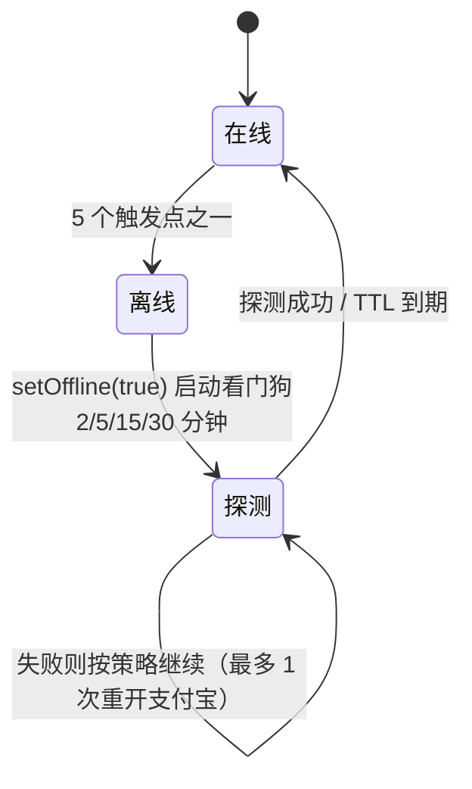

# 离线自愈与「一天一次」任务设计

> 状态：已实施（2026-09-29，PR #34）。
> 实施计划：[`../plans/2026-09-29-offline-selfheal-daily-once.md`](../plans/2026-09-29-offline-selfheal-daily-once.md)
> 适用面：`hook/ApplicationHook` / `hook/RequestManager` / `task/antForest/EnergyWaitingManager` /
> `task/DailyOnceAudit` / `task/antFarm/AntFarm` / `task/antForest/EcoLife`。

## 背景

两个来自主设备（小米 17）的实机反馈，各自有完整的日志证据（2026-09-28 当天）。

### 问题 1：离线期间静默停摆

| 时间 | 事件 |
| --- | --- |
| 19:07:19 | `刷新背包失败: RPC返回为空` |
| 19:07:40 | `背包查询连续失败，进入 15 分钟退避` |
| 19:08:06 | `正在尝试执行离线恢复策略...` → `offline = true` |
| 19:08–19:57 | 蹲点反复 `遇本地暂停，顺延 60 秒后再试（不消耗重试次数）`，共约 1700 行 |
| 19:59 | 宿主重建才恢复 —— **中间 52 分钟一个能量球都没收** |

根因不是「离线」本身，而是**离线之后没有任何机制再去探测**：

1. `TaskRunner` 见 `ApplicationHook.offline` 直接跳过整轮 → 不再产生请求；
2. 蹲点的每次尝试都被 `executeRpc` 的离线门控拦下 → 也只产生失败日志；
3. `handleOfflineRecovery` 通过 `recoveryPolicy.scheduleNetworkRecoveryOnce()` **只调度一次**
   `reOpenApp`，失败就没有第二轮；
4. 30 分钟 TTL 自愈要求「存在验证标志」（`releaseExpiredVerificationPause`），
   而这是**网络类**离线、没有标志 → 判定不成立；
5. 状态变化没有显式日志，用户与排查者都看不出「现在处于离线」。

### 问题 2：一天一次的任务被反复执行

同一句话当天出现次数（≈ 轮次数）：庄园任务[秋叶月饼]/[旧衣回收]/[逛闪购] 各 44 次、
[到店付款] 40 次、绿色打卡 46 次。任务服务端一天只认一次，重复执行是白跑请求，
且在风控窗口里放大请求量。

而「限制」本身有反作用：`Status.flagList` 跨日整体清空，一旦把**没成功**的任务误判为
「今天已完成」，它会整天不再执行，事后无从发现。

## 目标

1. 离线/暂停期间**有东西主动探测**，恢复后自动解除，并把「进了离线 / 停了多久」写进日志；
2. 离线期间**不再空转重试**（任务保留，不烧重试次数、不刷日志）；
3. 一天一次的任务**成功后即锁定**，且只在服务端返回成功时锁；
4. 锁定行为**可核对**：第二天能确认「被限制的任务到底完成没有」。

## 非目标

- 不改变离线判定阈值本身（`setMaxErrorCount` 等仍由用户配置）；
- 不自动完成安全验证（依然要求人工，或等 30 分钟 TTL）；
- 不把所有任务都改成一天一次（有「剩余次数」机制的玩法不能锁，见「边界」）。

## 设计

### A. 离线自愈



| 组件 | 职责 |
| --- | --- |
| `OfflineRecoveryPolicy`（新，纯逻辑） | 探测节奏（2/5/15/30 分钟，封顶 30）、重开上限 1 次、5 次后静默 |
| `ApplicationHook.setOffline` | **唯一入口**：记录进入时间、打显式日志、启动看门狗；解除时打持续时长并恢复蹲点 |
| `RequestManager.probeOfflineRecovery` | ① 验证暂停 → 试 TTL；② 否则绕过门控发一次轻量主页查询验证链路 |
| `EnergyWaitingManager` | 离线期间不重试（只提示一次）；`onOfflineCleared()` 就地恢复全部待收任务 |

探测请求刻意复用**正常轮次的第一条请求**（森林主页查询），所以不引入新的接口面，
只是把节奏从「一轮一次」加密到「离线时最多 2 分钟一次」。

### B. 一天一次 + 台账

```
任务成功 ──┬─► Status.setFlagToday(flag)          ← 当天不再进这个任务
           └─► DailyOnceAudit.record(flag, label)  ← 追加到 daily_once.json（保留 7 天）
```

- 锁定**只发生在成功分支**；失败 / 未受理 / 状态未推进一律不锁。
- 台账按「自然日 + flag」去重，只保留**最早**那次（首次成功才是锁定时刻）。
- `flagList` 跨日清空、台账跨日保留，两者互补：前者管行为，后者管追溯。

## 数据结构

`config/<userId>/daily_once.json`：

```json
{
  "2026-09-28": [
    { "at": 1790611068371, "flag": "farm::task::limit::HEART_DONATION_ADVANCED_FOOD_V2",
      "label": "庄园任务[秋叶月饼任务]" }
  ]
}
```

标志命名约定：`<模块或功能>::<语义>::<对象 id>`，例如 `farm::task::limit::SHANGOU_xiadan`、
`EcoLife::tick::photoguangpan`。

## 错误处理

- 台账读写全部 `runCatching` 包裹：**任何失败都不得影响任务流程**，只记日志；
- 探测请求失败只更新计数，不抛给调用方；
- `onOfflineCleared()` 无待收任务时直接返回，不做任何调度。

## 测试

| 层 | 内容 |
| --- | --- |
| 纯逻辑 | `OfflineRecoveryPolicyTest`（节奏递增与封顶、重开上限、日志静默）、`DailyOnceAuditTest`（同日去重保留最早、跨日保留、7 天裁剪、GMT+8 日键） |
| 实机 | 装上后首轮即验证台账落盘（2026-09-28 23:57 三条锁定）；离线全链路等下一次真实离线 |

## 边界与已知取舍

1. **C1 海洋 AI 摸鱼不锁定**：它重复的是「完成**未受理**」（服务端没收下），锁定会让一个没成功的任务
   整天不再尝试 —— 正确做法是退避，阈值待定。
2. **D1 IP 抽抽乐不锁定**：抽抽乐有「剩余次数」机制，成功后锁定会浪费当天剩余次数，
   属于「限制了之后任务没做完」。
3. **TTL 只对验证暂停生效**：网络类离线没有验证标志，所以不能靠 TTL 自愈，只能靠探测 ——
   这正是本设计要补的那一环。
4. **探测的请求量**：最坏情况 2 分钟一次（离线持续时），比正常轮次密；但离线本身意味着请求本来就不通，
   恢复后立即停止探测，整体请求量仍低于「恢复后立刻跑一整轮」。
